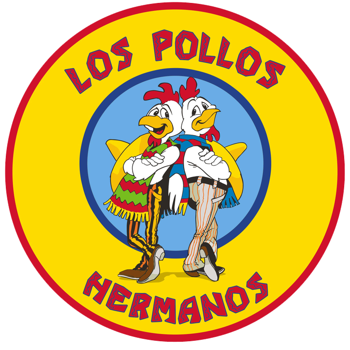

<!-- PROJECT LOGO -->
<br />
<div align="center">
  <a href="https://github.com/othneildrew/Best-README-Template">
     
  </a>
   <a href="https://github.com/othneildrew/Best-README-Template">
     
  </a>

  <h3 align="center">Los Pollos Hermanos Landing Page</h3>

  <p align="center">
    A fan-made landing page for a fictional restaurant from the multi-award-winning television series <a href="https://www.sonypictures.com/tv/breakingbad">Breaking Bad</a>, created and produced by Vince Gilligan.
    <br />
    <!-- <a href="https://github.com/othneildrew/Best-README-Template"><strong>Explore the docs »</strong></a>
    <br />
    <br />
    <a href="https://github.com/othneildrew/Best-README-Template">View Demo</a>
    ·
    <a href="https://github.com/othneildrew/Best-README-Template/issues">Report Bug</a>
    ·
    <a href="https://github.com/othneildrew/Best-README-Template/issues">Request Feature</a> -->
  </p>
</div>

## ✨ Links: 
+ [Live Preview](https://los-pollos-hermanos-5ba22.web.app/)
  
## Quick Start

Options:

- [Download from Github](https://github.com/creativetimofficial/awesome-landing-page.git).
- Clone the repository: `git clone https://github.com/css416/Los-Pollos-Landing-Page.git`.

## 🚀 Usage

Make sure you have [Node.js](https://nodejs.org/en/) installed.

1 - Install all the dependencies:

```sh
npm **install**
```

2 - Start the server using the command:
```sh
npm **start**
```